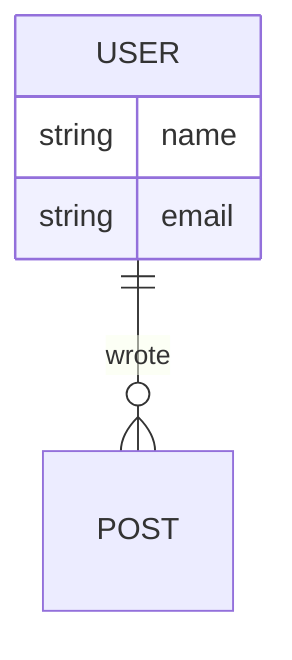
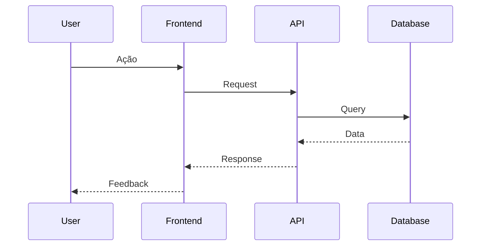
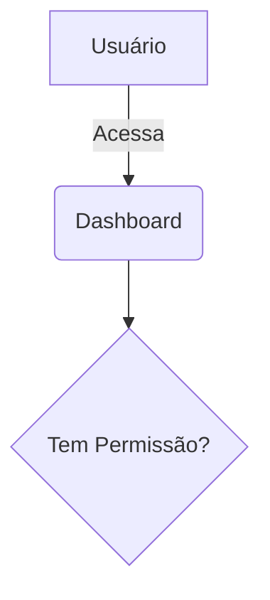

# Documentation Architect

Este workflow guia a criação de documentação visual e técnica do projeto.

## 1. Identificar o Tipo de Documentação
Identifique qual diagrama foi solicitado:
- **DER (Diagrama de Entidade-Relacionamento)**: Para modelagem de banco de dados.
- **Diagrama de Sequência**: Para fluxos lógicos complexos (Frontend -> API -> DB).
- **Casos de Uso**: Para mapear funcionalidades do usuário.
- **Visão Macro**: Para arquitetura geral e fluxo de dados do sistema.

## 2. Coleta de Informações
- **Para DER**:
  - Busque arquivos de schema (ex: `schema.prisma`, `drizzle/schema.ts`, `lib/db/schema.ts`).
  - Use `read_file` para entender as tabelas e relacionamentos.
- **Para Sequência**:
  - Identifique o ponto de entrada (ex: `app/api/route.ts` ou Server Action).
  - Rastreie as chamadas para services, utils e banco de dados.
- **Para Casos de Uso / Visão Macro**:
  - Liste as rotas principais em `app/`.
  - Identifique os "Features" principais (Dashboards, Cadastros, Relatórios).

## 3. Geração dos Diagramas (Mermaid)

### A. DER (ER Diagram)
Use a sintaxe `erDiagram`.

### B. Diagrama de Sequência
Use a sintaxe `sequenceDiagram`.

### C. Casos de Uso / Visão Macro
Use `graph TD` ou `mindmap`.

## 4. Criação do Artefato
1. Crie ou atualize um arquivo em `docs/` (ex: `docs/ARCHITECTURE.md` ou `docs/DIAGRAMS.md`).
2. Insira os diagramas em blocos de código `mermaid`.
3. Adicione uma breve explicação contextualizando cada diagrama.

## Exemplo de Comando
"Gere um DER do banco de dados atual" -> O agente lerá o schema e criará o diagrama ER mermaid correspondente.
