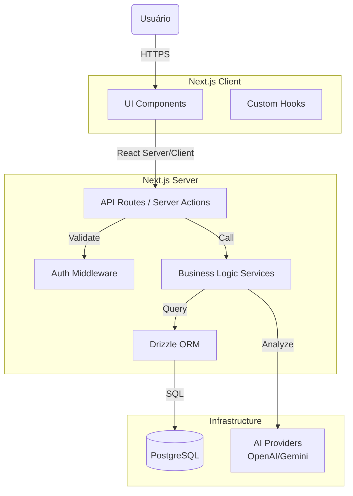
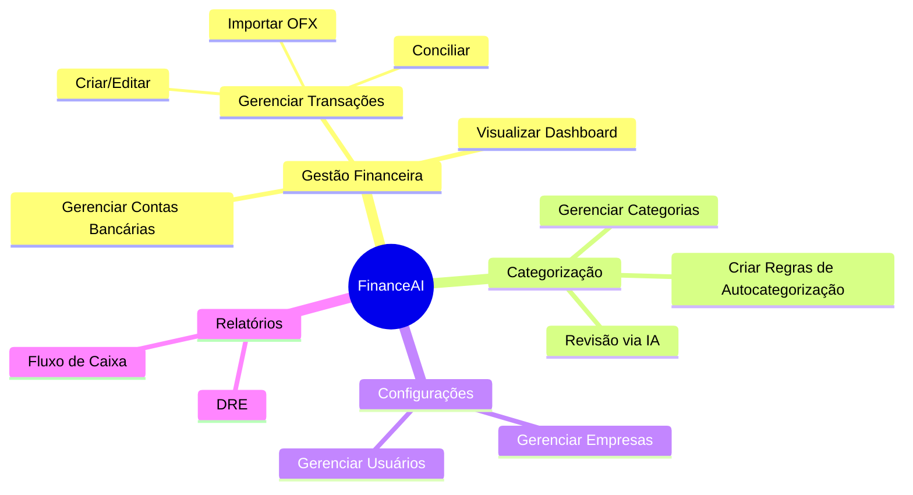
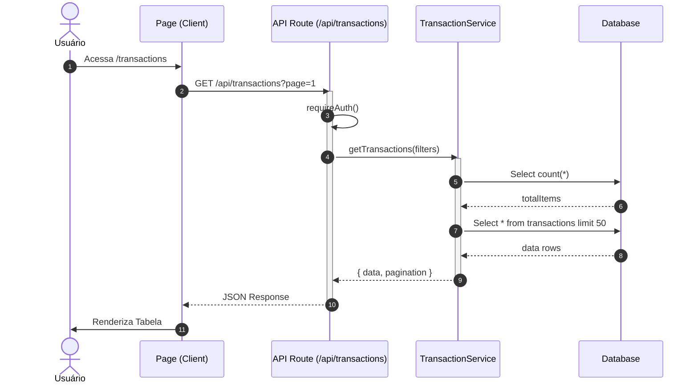
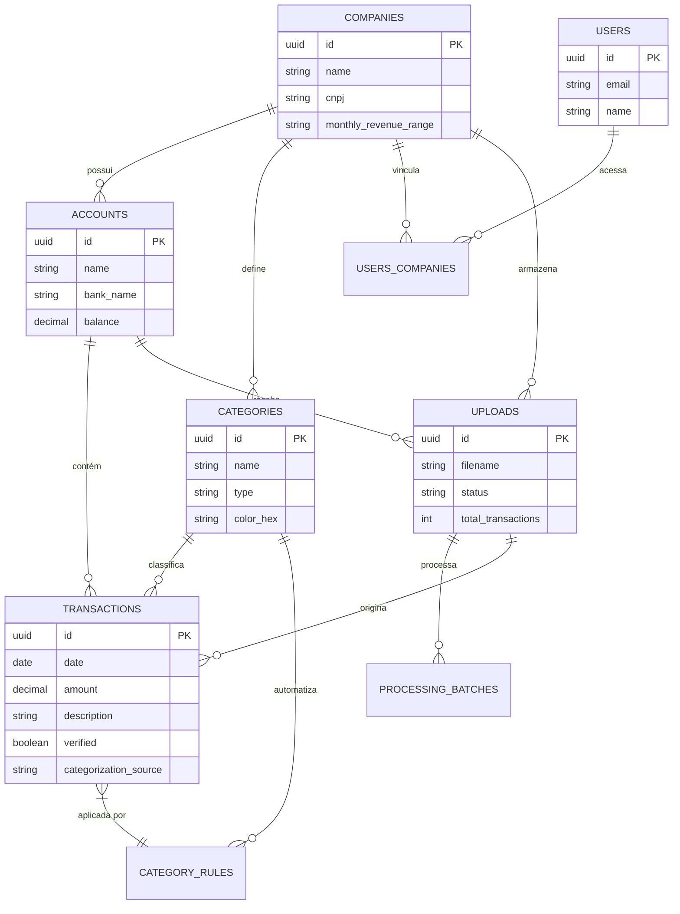

# Arquitetura do Sistema FinanceAI

Este documento descreve a arquitetura técnica, modelo de dados e fluxos principais do projeto FinanceAI.

---

## 1. Visão Macro (Architecture Overview)

O sistema utiliza uma arquitetura **Monolítica Modular** baseada em Next.js (App Router), hospedada na Vercel, com banco de dados PostgreSQL.

---

## 2. Diagrama de Casos de Uso (Use Cases)

Funcionalidades principais disponíveis para os usuários "Donos" de empresas.

---

## 3. Diagrama de Sequência (Fluxo de Transações)

Exemplo do fluxo de listagem de transações, demonstrando a interação entre camadas.

---

## 4. DER (Diagrama de Entidade-Relacionamento)

Modelo de dados baseado no `lib/db/schema.ts`.

