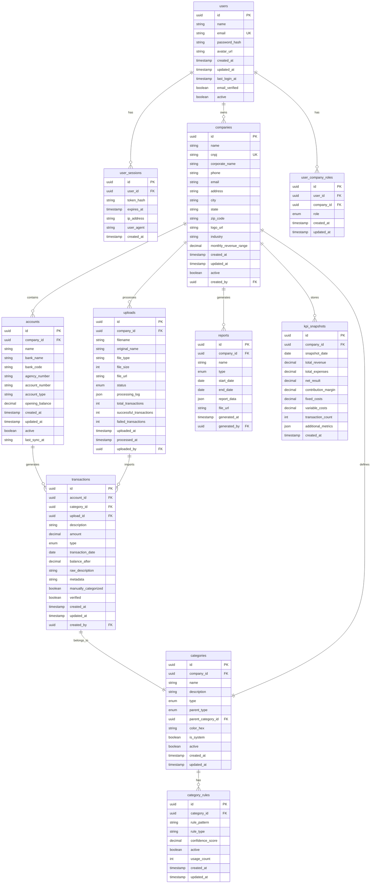

# FinanceAI - Modelo de Dados (DER)

**Versão**: 1.0
**Data**: 23 de Outubro de 2025
**Database**: PostgreSQL via Supabase
**ORM**: Drizzle

---

## 📋 Sumário Executivo

Este documento define o modelo de dados relacional para o FinanceAI, incluindo todas as entidades, relacionamentos, índices e otimizações necessárias para suportar o volume de transações e as consultas analíticas do sistema.

### Entidades Principais
- **users** - Gestão de usuários e autenticação
- **companies** - Dados das empresas clientes
- **accounts** - Contas bancárias por empresa
- **transactions** - Transações financeiras
- **categories** - Categorias de transações
- **uploads** - Histórico de uploads de extratos
- **reports** - Relatórios gerados
- **user_sessions** - Sessões de autenticação

---

## 🗄️ Diagrama ERD (Mermaid)



---

## 📋 Definição Detalhada das Entidades

### 1. users - Gestão de Usuários

**Descrição**: Tabela principal de usuários do sistema, integrada com Auth.js.

```sql
CREATE TABLE users (
    id UUID PRIMARY KEY DEFAULT gen_random_uuid(),
    name VARCHAR(255) NOT NULL,
    email VARCHAR(255) UNIQUE NOT NULL,
    password_hash VARCHAR(255) NOT NULL,
    avatar_url TEXT,
    created_at TIMESTAMP WITH TIME ZONE DEFAULT NOW(),
    updated_at TIMESTAMP WITH TIME ZONE DEFAULT NOW(),
    last_login_at TIMESTAMP WITH TIME ZONE,
    email_verified BOOLEAN DEFAULT FALSE,
    active BOOLEAN DEFAULT TRUE
);
```

**Índices:**
```sql
CREATE INDEX idx_users_email ON users(email);
CREATE INDEX idx_users_active ON users(active);
CREATE INDEX idx_users_created_at ON users(created_at);
```

### 2. user_sessions - Sessões de Autenticação

**Descrição**: Controle de sessões ativas dos usuários para gerenciamento de segurança.

```sql
CREATE TABLE user_sessions (
    id UUID PRIMARY KEY DEFAULT gen_random_uuid(),
    user_id UUID NOT NULL REFERENCES users(id) ON DELETE CASCADE,
    token_hash VARCHAR(255) NOT NULL,
    expires_at TIMESTAMP WITH TIME ZONE NOT NULL,
    ip_address INET,
    user_agent TEXT,
    created_at TIMESTAMP WITH TIME ZONE DEFAULT NOW()
);
```

**Índices:**
```sql
CREATE INDEX idx_user_sessions_user_id ON user_sessions(user_id);
CREATE INDEX idx_user_sessions_token_hash ON user_sessions(token_hash);
CREATE INDEX idx_user_sessions_expires_at ON user_sessions(expires_at);
```

### 3. companies - Empresas Clientes

**Descrição**: Dados principais das empresas clientes do FinanceAI.

```sql
CREATE TABLE companies (
    id UUID PRIMARY KEY DEFAULT gen_random_uuid(),
    name VARCHAR(255) NOT NULL,
    cnpj VARCHAR(14) UNIQUE NOT NULL,
    corporate_name VARCHAR(255),
    phone VARCHAR(20),
    email VARCHAR(255),
    address TEXT,
    city VARCHAR(100),
    state VARCHAR(2),
    zip_code VARCHAR(9),
    logo_url TEXT,
    industry VARCHAR(100),
    monthly_revenue_range DECIMAL(12,2),
    created_at TIMESTAMP WITH TIME ZONE DEFAULT NOW(),
    updated_at TIMESTAMP WITH TIME ZONE DEFAULT NOW(),
    active BOOLEAN DEFAULT TRUE,
    created_by UUID REFERENCES users(id)
);
```

**Índices:**
```sql
CREATE UNIQUE INDEX idx_companies_cnpj ON companies(cnpj);
CREATE INDEX idx_companies_active ON companies(active);
CREATE INDEX idx_companies_created_at ON companies(created_at);
```

### 4. user_company_roles - Relacionamento Usuário-Empresa

**Descrição**: Define papéis dos usuários em cada empresa.

```sql
CREATE TABLE user_company_roles (
    id UUID PRIMARY KEY DEFAULT gen_random_uuid(),
    user_id UUID NOT NULL REFERENCES users(id) ON DELETE CASCADE,
    company_id UUID NOT NULL REFERENCES companies(id) ON DELETE CASCADE,
    role VARCHAR(20) NOT NULL CHECK (role IN ('admin', 'viewer', 'editor')),
    created_at TIMESTAMP WITH TIME ZONE DEFAULT NOW(),
    updated_at TIMESTAMP WITH TIME ZONE DEFAULT NOW(),
    UNIQUE(user_id, company_id)
);
```

**Índices:**
```sql
CREATE UNIQUE INDEX idx_user_company_roles_unique ON user_company_roles(user_id, company_id);
CREATE INDEX idx_user_company_roles_user_id ON user_company_roles(user_id);
CREATE INDEX idx_user_company_roles_company_id ON user_company_roles(company_id);
```

### 5. accounts - Contas Bancárias

**Descrição**: Contas bancárias cadastradas por empresa.

```sql
CREATE TABLE accounts (
    id UUID PRIMARY KEY DEFAULT gen_random_uuid(),
    company_id UUID NOT NULL REFERENCES companies(id) ON DELETE CASCADE,
    name VARCHAR(255) NOT NULL,
    bank_name VARCHAR(100) NOT NULL,
    bank_code VARCHAR(10) NOT NULL,
    agency_number VARCHAR(20),
    account_number VARCHAR(30) NOT NULL,
    account_type VARCHAR(20) CHECK (account_type IN ('checking', 'savings', 'investment')),
    opening_balance DECIMAL(15,2) DEFAULT 0,
    created_at TIMESTAMP WITH TIME ZONE DEFAULT NOW(),
    updated_at TIMESTAMP WITH TIME ZONE DEFAULT NOW(),
    active BOOLEAN DEFAULT TRUE,
    last_sync_at TIMESTAMP WITH TIME ZONE
);
```

**Índices:**
```sql
CREATE INDEX idx_accounts_company_id ON accounts(company_id);
CREATE INDEX idx_accounts_active ON accounts(active);
CREATE INDEX idx_accounts_last_sync ON accounts(last_sync_at);
```

### 6. transactions - Transações Financeiras

**Descrição**: Tabela principal de transações financeiras.

```sql
CREATE TABLE transactions (
    id UUID PRIMARY KEY DEFAULT gen_random_uuid(),
    account_id UUID NOT NULL REFERENCES accounts(id) ON DELETE CASCADE,
    category_id UUID REFERENCES categories(id),
    upload_id UUID REFERENCES uploads(id) ON DELETE SET NULL,
    description TEXT NOT NULL,
    amount DECIMAL(15,2) NOT NULL,
    type VARCHAR(10) NOT NULL CHECK (type IN ('credit', 'debit')),
    transaction_date DATE NOT NULL,
    balance_after DECIMAL(15,2),
    raw_description TEXT,
    metadata JSONB,
    manually_categorized BOOLEAN DEFAULT FALSE,
    verified BOOLEAN DEFAULT FALSE,
    created_at TIMESTAMP WITH TIME ZONE DEFAULT NOW(),
    updated_at TIMESTAMP WITH TIME ZONE DEFAULT NOW(),
    created_by UUID REFERENCES users(id)
);
```

**Índices:**
```sql
CREATE INDEX idx_transactions_account_id ON transactions(account_id);
CREATE INDEX idx_transactions_category_id ON transactions(category_id);
CREATE INDEX idx_transactions_date ON transactions(transaction_date);
CREATE INDEX idx_transactions_type ON transactions(type);
CREATE INDEX idx_transactions_amount ON transactions(amount);
CREATE INDEX idx_transactions_upload_id ON transactions(upload_id);
CREATE INDEX idx_transactions_verified ON transactions(verified);

-- Índices compostos para performance de consultas analíticas
CREATE INDEX idx_transactions_composite ON transactions(company_id, transaction_date, type);
CREATE INDEX idx_transactions_date_amount ON transactions(transaction_date DESC, amount DESC);
```

### 7. categories - Categorias de Transações

**Descrição**: Categorias para classificação de transações.

```sql
CREATE TABLE categories (
    id UUID PRIMARY KEY DEFAULT gen_random_uuid(),
    company_id UUID REFERENCES companies(id) ON DELETE CASCADE,
    name VARCHAR(100) NOT NULL,
    description TEXT,
    type VARCHAR(30) NOT NULL CHECK (type IN ('revenue', 'variable_cost', 'fixed_cost', 'non_operational')),
    parent_type VARCHAR(30),
    parent_category_id UUID REFERENCES categories(id),
    color_hex VARCHAR(7) DEFAULT '#6366F1',
    is_system BOOLEAN DEFAULT FALSE,
    active BOOLEAN DEFAULT TRUE,
    created_at TIMESTAMP WITH TIME ZONE DEFAULT NOW(),
    updated_at TIMESTAMP WITH TIME ZONE DEFAULT NOW(),
    UNIQUE(company_id, name)
);
```

**Índices:**
```sql
CREATE INDEX idx_categories_company_id ON categories(company_id);
CREATE INDEX idx_categories_type ON categories(type);
CREATE INDEX idx_categories_parent_id ON categories(parent_category_id);
CREATE INDEX idx_categories_active ON categories(active);
CREATE UNIQUE INDEX idx_categories_unique ON categories(company_id, name);
```

### 8. category_rules - Regras de Categorização

**Descrição**: Regras para categorização automática de transações.

```sql
CREATE TABLE category_rules (
    id UUID PRIMARY KEY DEFAULT gen_random_uuid(),
    category_id UUID NOT NULL REFERENCES categories(id) ON DELETE CASCADE,
    rule_pattern VARCHAR(500) NOT NULL,
    rule_type VARCHAR(20) NOT NULL CHECK (rule_type IN ('contains', 'regex', 'exact')),
    confidence_score DECIMAL(3,2) DEFAULT 0.80,
    active BOOLEAN DEFAULT TRUE,
    usage_count INTEGER DEFAULT 0,
    created_at TIMESTAMP WITH TIME ZONE DEFAULT NOW(),
    updated_at TIMESTAMP WITH TIME ZONE DEFAULT NOW()
);
```

**Índices:**
```sql
CREATE INDEX idx_category_rules_category_id ON category_rules(category_id);
CREATE INDEX idx_category_rules_active ON category_rules(active);
CREATE INDEX idx_category_rules_confidence ON category_rules(confidence_score DESC);
```

### 9. uploads - Uploads de Extratos

**Descrição**: Controle dos uploads de arquivos de extratos.

```sql
CREATE TABLE uploads (
    id UUID PRIMARY KEY DEFAULT gen_random_uuid(),
    company_id UUID NOT NULL REFERENCES companies(id) ON DELETE CASCADE,
    filename VARCHAR(255) NOT NULL,
    original_name VARCHAR(255) NOT NULL,
    file_type VARCHAR(10) NOT NULL CHECK (file_type IN ('ofx', 'xlsx', 'csv')),
    file_size INTEGER NOT NULL,
    file_url TEXT,
    status VARCHAR(20) NOT NULL CHECK (status IN ('pending', 'processing', 'completed', 'failed')),
    processing_log JSONB,
    total_transactions INTEGER DEFAULT 0,
    successful_transactions INTEGER DEFAULT 0,
    failed_transactions INTEGER DEFAULT 0,
    uploaded_at TIMESTAMP WITH TIME ZONE DEFAULT NOW(),
    processed_at TIMESTAMP WITH TIME ZONE,
    uploaded_by UUID REFERENCES users(id)
);
```

**Índices:**
```sql
CREATE INDEX idx_uploads_company_id ON uploads(company_id);
CREATE INDEX idx_uploads_status ON uploads(status);
CREATE INDEX idx_uploads_uploaded_at ON uploads(uploaded_at DESC);
CREATE INDEX idx_uploads_processed_at ON uploads(processed_at);
```

### 10. reports - Relatórios Gerados

**Descrição**: Histórico de relatórios gerados pelo sistema.

```sql
CREATE TABLE reports (
    id UUID PRIMARY KEY DEFAULT gen_random_uuid(),
    company_id UUID NOT NULL REFERENCES companies(id) ON DELETE CASCADE,
    name VARCHAR(255) NOT NULL,
    type VARCHAR(30) NOT NULL CHECK (type IN ('dre', 'cash_flow', 'monthly_summary', 'custom')),
    start_date DATE NOT NULL,
    end_date DATE NOT NULL,
    report_data JSONB NOT NULL,
    file_url TEXT,
    generated_at TIMESTAMP WITH TIME ZONE DEFAULT NOW(),
    generated_by UUID REFERENCES users(id)
);
```

**Índices:**
```sql
CREATE INDEX idx_reports_company_id ON reports(company_id);
CREATE INDEX idx_reports_type ON reports(type);
CREATE INDEX idx_reports_date_range ON reports(start_date, end_date);
CREATE INDEX idx_reports_generated_at ON reports(generated_at DESC);
```

### 11. kpi_snapshots - Snapshots de KPIs

**Descrição**: Cache pré-calculado de KPIs para performance do dashboard.

```sql
CREATE TABLE kpi_snapshots (
    id UUID PRIMARY KEY DEFAULT gen_random_uuid(),
    company_id UUID NOT NULL REFERENCES companies(id) ON DELETE CASCADE,
    snapshot_date DATE NOT NULL,
    total_revenue DECIMAL(15,2) DEFAULT 0,
    total_expenses DECIMAL(15,2) DEFAULT 0,
    net_result DECIMAL(15,2) DEFAULT 0,
    contribution_margin DECIMAL(5,2) DEFAULT 0,
    fixed_costs DECIMAL(15,2) DEFAULT 0,
    variable_costs DECIMAL(15,2) DEFAULT 0,
    transaction_count INTEGER DEFAULT 0,
    additional_metrics JSONB,
    created_at TIMESTAMP WITH TIME ZONE DEFAULT NOW(),
    UNIQUE(company_id, snapshot_date)
);
```

**Índices:**
```sql
CREATE UNIQUE INDEX idx_kpi_snapshots_unique ON kpi_snapshots(company_id, snapshot_date);
CREATE INDEX idx_kpi_snapshots_company_date ON kpi_snapshots(company_id, snapshot_date DESC);
CREATE INDEX idx_kpi_snapshots_date ON kpi_snapshots(snapshot_date DESC);
```

---

## 🔧 Constraints e Regras de Integridade

### Chaves Estrangeiras (Foreign Keys)
```sql
-- Todas as FKs com CASCADE para delete onde apropriado
ALTER TABLE user_sessions ADD CONSTRAINT fk_sessions_user
    FOREIGN KEY (user_id) REFERENCES users(id) ON DELETE CASCADE;

ALTER TABLE accounts ADD CONSTRAINT fk_accounts_company
    FOREIGN KEY (company_id) REFERENCES companies(id) ON DELETE CASCADE;

ALTER TABLE transactions ADD CONSTRAINT fk_transactions_account
    FOREIGN KEY (account_id) REFERENCES accounts(id) ON DELETE CASCADE;
```

### Check Constraints
```sql
-- Validações de dados importantes
ALTER TABLE companies ADD CONSTRAINT chk_cnpj_format
    CHECK (cnpj ~ '^\d{14}$');

ALTER TABLE accounts ADD CONSTRAINT chk_opening_balance
    CHECK (opening_balance >= 0);

ALTER TABLE transactions ADD CONSTRAINT chk_transaction_amount
    CHECK (amount != 0);

ALTER TABLE kpi_snapshots ADD CONSTRAINT chk_margin_range
    CHECK (contribution_margin BETWEEN -100 AND 100);
```

### Triggers para Timestamps
```sql
-- Trigger automático para updated_at
CREATE OR REPLACE FUNCTION update_updated_at_column()
RETURNS TRIGGER AS $$
BEGIN
    NEW.updated_at = NOW();
    RETURN NEW;
END;
$$ language 'plpgsql';

CREATE TRIGGER update_users_updated_at BEFORE UPDATE ON users
    FOR EACH ROW EXECUTE FUNCTION update_updated_at_column();

CREATE TRIGGER update_companies_updated_at BEFORE UPDATE ON companies
    FOR EACH ROW EXECUTE FUNCTION update_updated_at_column();
```

---

## 📊 Otimizações de Performance

### Índices para Consultas Analíticas

#### Dashboard KPIs Query
```sql
-- Query principal para dashboard
EXPLAIN ANALYZE
SELECT
    DATE_TRUNC('month', t.transaction_date) as month,
    SUM(CASE WHEN t.type = 'credit' THEN t.amount ELSE 0 END) as revenue,
    SUM(CASE WHEN t.type = 'debit' THEN t.amount ELSE 0 END) as expenses,
    COUNT(*) as transaction_count
FROM transactions t
JOIN accounts a ON t.account_id = a.id
WHERE a.company_id = $1
    AND t.transaction_date >= $2
    AND t.transaction_date <= $3
GROUP BY DATE_TRUNC('month', t.transaction_date)
ORDER BY month DESC;
```

#### DRE Calculation Query
```sql
-- Query para DRE detalhado
EXPLAIN ANALYZE
WITH RECURSIVE category_hierarchy AS (
    SELECT id, name, type, parent_category_id, 0 as level
    FROM categories
    WHERE parent_category_id IS NULL

    UNION ALL

    SELECT c.id, c.name, c.type, c.parent_category_id, ch.level + 1
    FROM categories c
    JOIN category_hierarchy ch ON c.parent_category_id = ch.id
)
SELECT
    ch.type,
    ch.name as category_name,
    SUM(t.amount) as total_amount,
    COUNT(t.id) as transaction_count
FROM category_hierarchy ch
JOIN categories c ON ch.id = c.id
JOIN transactions t ON t.category_id = c.id
JOIN accounts a ON t.account_id = a.id
WHERE a.company_id = $1
    AND t.transaction_date >= $2
    AND t.transaction_date <= $3
GROUP BY ch.id, ch.type, ch.name
ORDER BY ch.type, total_amount DESC;
```

### Materialized Views (Opcional para alta escala)

```sql
-- Materialized view para KPIs mensais
CREATE MATERIALIZED VIEW monthly_kpi_metrics AS
SELECT
    a.company_id,
    DATE_TRUNC('month', t.transaction_date) as month,
    SUM(CASE WHEN t.type = 'credit' THEN t.amount ELSE 0 END) as revenue,
    SUM(CASE WHEN t.type = 'debit' THEN t.amount ELSE 0 END) as expenses,
    COUNT(*) as transaction_count,
    MAX(t.transaction_date) as last_transaction_date
FROM transactions t
JOIN accounts a ON t.account_id = a.id
GROUP BY a.company_id, DATE_TRUNC('month', t.transaction_date);

-- Índice para materialized view
CREATE INDEX idx_monthly_kpi_company_month ON monthly_kpi_metrics(company_id, month DESC);

-- Refresh function
CREATE OR REPLACE FUNCTION refresh_monthly_kpi_metrics()
RETURNS void AS $$
BEGIN
    REFRESH MATERIALIZED VIEW CONCURRENTLY monthly_kpi_metrics;
END;
$$ LANGUAGE plpgsql;
```

---

## 🗂️ Estratégias de Particionamento (Futuro)

### Partitionamento por Data (para alto volume)
```sql
-- Partitionamento da tabela transactions por mês
CREATE TABLE transactions_partitioned (
    LIKE transactions INCLUDING ALL
) PARTITION BY RANGE (transaction_date);

-- Criar partições mensais
CREATE TABLE transactions_2025_01 PARTITION OF transactions_partitioned
    FOR VALUES FROM ('2025-01-01') TO ('2025-02-01');

CREATE TABLE transactions_2025_02 PARTITION OF transactions_partitioned
    FOR VALUES FROM ('2025-02-01') TO ('2025-03-01');
```

---

## 🔒 Segurança de Dados

### Row Level Security (RLS) com Supabase
```sql
-- Enable RLS nas tabelas principais
ALTER TABLE companies ENABLE ROW LEVEL SECURITY;
ALTER TABLE accounts ENABLE ROW LEVEL SECURITY;
ALTER TABLE transactions ENABLE ROW LEVEL SECURITY;

-- Policy para empresas (apenas donos podem ver)
CREATE POLICY "Users can view own companies" ON companies
    FOR ALL USING (
        created_by = auth.uid() OR
        id IN (
            SELECT company_id FROM user_company_roles
            WHERE user_id = auth.uid()
        )
    );

-- Policy para transações (via company ownership)
CREATE POLICY "Users can view company transactions" ON transactions
    FOR ALL USING (
        account_id IN (
            SELECT id FROM accounts
            WHERE company_id IN (
                SELECT company_id FROM user_company_roles
                WHERE user_id = auth.uid()
            )
        )
    );
```

---

## 📈 Estimativas de Volume

### Cálculos Baseados nos Requisitos
- **Empresas**: 50 (MVP) → 500 (6 meses)
- **Contas por empresa**: 3-10 em média
- **Transações por empresa**: 5.000/mês
- **Volume total**: 250.000 transações/mês (MVP)

### Storage Estimado
```sql
-- Estimativa de storage por tabela
SELECT
    schemaname,
    tablename,
    pg_size_pretty(pg_total_relation_size(schemaname||'.'||tablename)) as size
FROM pg_tables
WHERE schemaname = 'public'
ORDER BY pg_total_relation_size(schemaname||'.'||tablename) DESC;
```

### Performance Targets
- **Insert**: 1.000 transações/segundo
- **Select Dashboard**: < 500ms para KPIs principais
- **DRE Query**: < 2 segundos para período completo
- **Concurrent Users**: 50 simultâneos sem degradação

---

## 🚀 Migrations com Drizzle

### Estrutura de Migrations
```typescript
// drizzle/schema.ts
import { pgTable, uuid, varchar, decimal, date, boolean, timestamp } from 'drizzle-orm/pg-core';

export const users = pgTable('users', {
  id: uuid('id').primaryKey().defaultRandom(),
  name: varchar('name', { length: 255 }).notNull(),
  email: varchar('email', { length: 255 }).notNull().unique(),
  // ... outros campos
});

export const companies = pgTable('companies', {
  id: uuid('id').primaryKey().defaultRandom(),
  name: varchar('name', { length: 255 }).notNull(),
  cnpj: varchar('cnpj', { length: 14 }).notNull().unique(),
  // ... outros campos
});
```

### Scripts de Migration
```json
// package.json
{
  "scripts": {
    "db:generate": "drizzle-kit generate",
    "db:push": "drizzle-kit push",
    "db:migrate": "drizzle-kit migrate",
    "db:studio": "drizzle-kit studio"
  }
}
```

---

## ✅ Confirmação Necessária

**[AGUARDANDO CONFIRMAÇÃO DO STAKEHOLDER]**

Por favor, revise o modelo de dados e confirme se:

1. ✅ **Entidades principais** estão bem definidas
2. ✅ **Relacionamentos** fazem sentido para o negócio
3. ✅ **Índices** estão otimizados para as consultas principais
4. ✅ **Performance** considerations estão adequadas
5. ✅ **Segurança** (RLS) está bem implementada
6. ✅ **Escalabilidade** está contemplada

**Responda "CONFIRMAR" para avançar para os contratos de API e diagramas de sequência.**