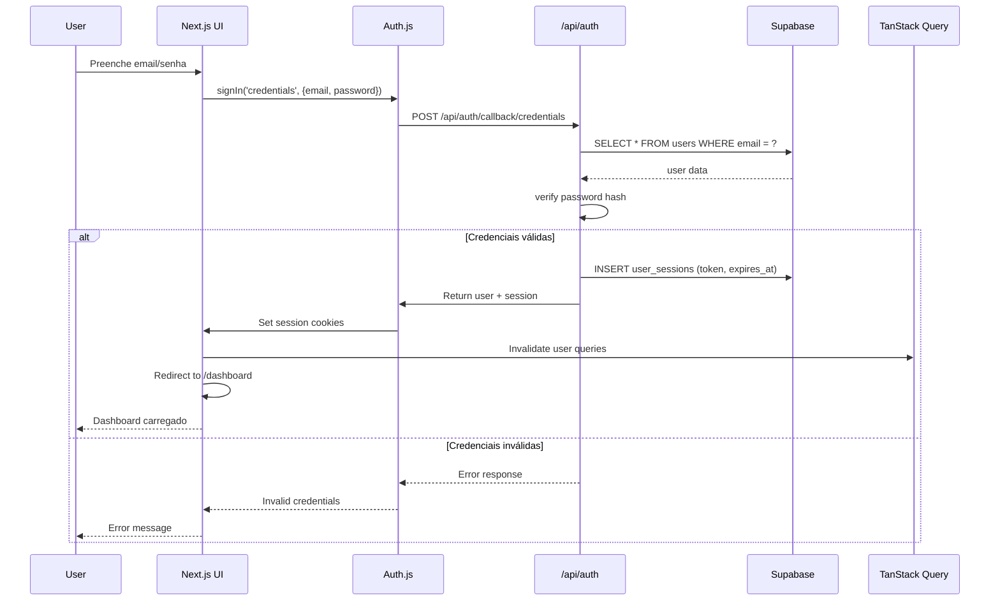
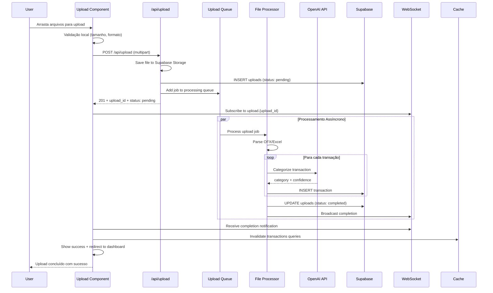
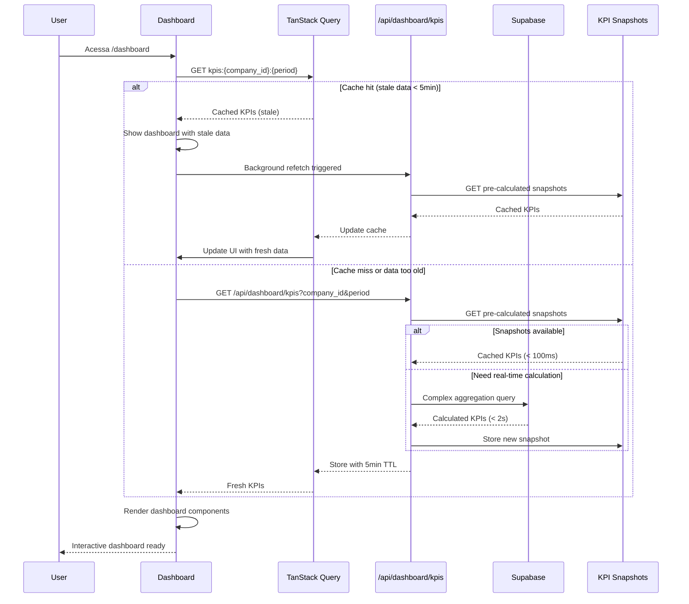
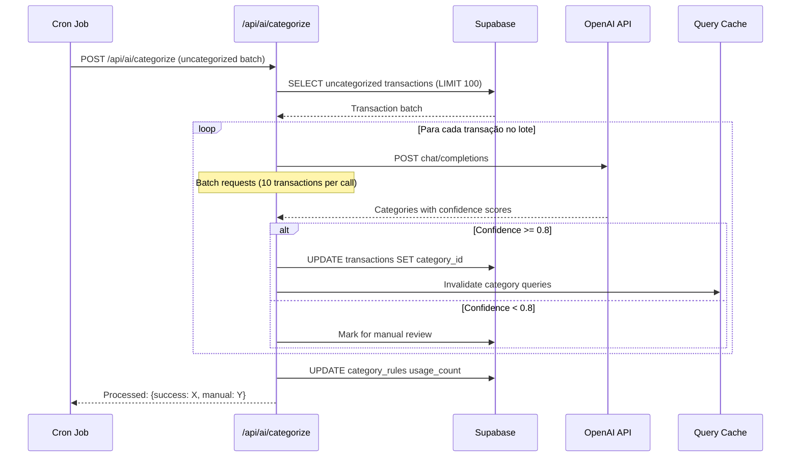
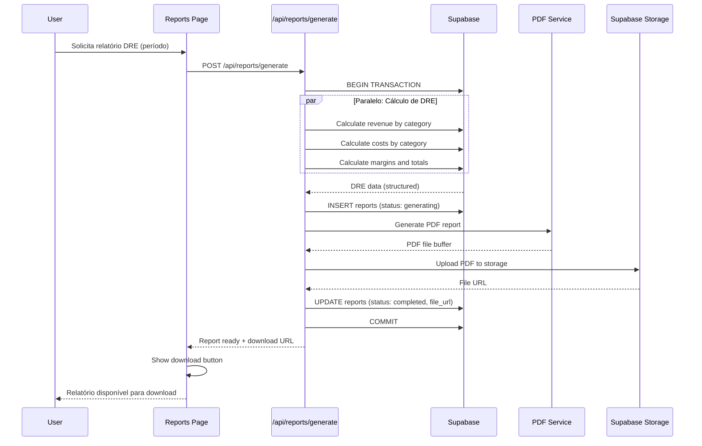

# FinanceAI - Contratos de API e Diagramas de Sequência

**Versão**: 1.0
**Data**: 23 de Outubro de 2025
**Stack**: Next.js 15 + Supabase + Drizzle ORM

---

## 📋 Sumário Executivo

Este documento define os contratos de API (DTOs), endpoints REST e diagramas de sequência para os fluxos críticos do FinanceAI. Inclui estratégias de cache, tratamento de erros e considerações de performance.

### Fluxos Críticos Documentados
1. **Autenticação e Login** - Fluxo completo de autenticação com Auth.js
2. **Upload de Extratos** - Processamento assíncrono de arquivos
3. **Dashboard Principal** - Carregamento com cache e performance
4. **Categorização IA** - Processamento em lote com OpenAI API
5. **Geração de Relatórios** - Exportação PDF/Excel

---

## 🔄 Diagramas de Sequência Principais

### 1. Fluxo de Autenticação e Login



**Pontos de Cache:** Invalidação de queries do usuário após login bem-sucedido.

---

### 2. Upload e Processamento de Extratos



**Pontos de Cache:** Invalidação de queries de transações após processamento. Background refresh automático.

---

### 3. Dashboard Principal com Cache



**Pontos de Cache:** 5 minutos TTL para KPIs, invalidação por mutações (upload, categorização).

---

### 4. Categorização com IA em Lote



**Pontos de Cache:** Invalidação de queries de categorias, atualização de regras.

---

### 5. Geração de Relatórios DRE



**Pontos de Cache:** Relatórios gerados ficam cacheados por 24h.

---

## 📄 Contratos de API (DTOs)

### Types Comuns

```typescript
// lib/types/common.ts
export interface BaseResponse<T = any> {
  success: boolean;
  data?: T;
  error?: string;
  message?: string;
}

export interface PaginationParams {
  page: number;
  limit: number;
  offset?: number;
}

export interface PaginatedResponse<T> extends BaseResponse<T[]> {
  pagination: {
    page: number;
    limit: number;
    total: number;
    totalPages: number;
    hasNext: boolean;
    hasPrev: boolean;
  };
}

export interface DateRange {
  startDate: string; // ISO date
  endDate: string;   // ISO date
}
```

### Autenticação DTOs

```typescript
// lib/types/auth.ts
export interface LoginRequest {
  email: string;
  password: string;
  remember?: boolean;
}

export interface LoginResponse {
  user: {
    id: string;
    name: string;
    email: string;
    avatar?: string;
  };
  session: {
    expires: string;
  };
  companies: Array<{
    id: string;
    name: string;
    role: 'admin' | 'editor' | 'viewer';
  }>;
}

export interface RegisterRequest {
  name: string;
  email: string;
  password: string;
  companyName: string;
  cnpj: string;
}

export interface RefreshTokenRequest {
  refreshToken: string;
}
```

### Upload DTOs

```typescript
// lib/types/upload.ts
export interface UploadRequest {
  files: File[];
  accountId: string;
}

export interface UploadResponse {
  uploadId: string;
  status: 'pending' | 'processing' | 'completed' | 'failed';
  totalTransactions?: number;
  estimatedTime?: number; // seconds
}

export interface UploadStatus {
  id: string;
  status: 'pending' | 'processing' | 'completed' | 'failed';
  progress: number; // 0-100
  totalTransactions: number;
  processedTransactions: number;
  successfulTransactions: number;
  failedTransactions: number;
  startedAt?: string;
  completedAt?: string;
  errors?: string[];
}
```

### Transactions DTOs

```typescript
// lib/types/transactions.ts
export interface Transaction {
  id: string;
  accountId: string;
  categoryId?: string;
  description: string;
  amount: number;
  type: 'credit' | 'debit';
  transactionDate: string;
  balanceAfter?: number;
  manuallyCategorized: boolean;
  verified: boolean;
  createdAt: string;
  updatedAt: string;
}

export interface CreateTransactionRequest {
  accountId: string;
  description: string;
  amount: number;
  type: 'credit' | 'debit';
  transactionDate: string;
  categoryId?: string;
}

export interface UpdateTransactionRequest {
  categoryId?: string;
  description?: string;
  verified?: boolean;
}

export interface TransactionFilters {
  accountId?: string[];
  categoryId?: string[];
  type?: 'credit' | 'debit';
  dateFrom?: string;
  dateTo?: string;
  search?: string;
  verified?: boolean;
  manuallyCategorized?: boolean;
}
```

### Dashboard DTOs

```typescript
// lib/types/dashboard.ts
export interface DashboardKPIs {
  period: {
    startDate: string;
    endDate: string;
  };
  current: {
    totalRevenue: number;
    totalExpenses: number;
    netResult: number;
    contributionMargin: number;
    transactionCount: number;
  };
  comparison: {
    revenueChange: number; // percentage
    expensesChange: number;
    netResultChange: number;
    marginChange: number;
  };
  alerts: Array<{
    type: 'warning' | 'error' | 'info';
    message: string;
    metric?: string;
  }>;
}

export interface EvolutionData {
  month: string;
  revenue: number;
  expenses: number;
  netResult: number;
  transactionCount: number;
}

export interface CategoryBreakdown {
  categoryId: string;
  categoryName: string;
  categoryType: 'revenue' | 'variable_cost' | 'fixed_cost' | 'non_operational';
  amount: number;
  percentage: number;
  transactionCount: number;
  color: string;
}

export interface DailyCashFlow {
  date: string;
  inflow: number;
  outflow: number;
  netFlow: number;
  balance: number;
}
```

### Categories DTOs

```typescript
// lib/types/categories.ts
export interface Category {
  id: string;
  companyId?: string;
  name: string;
  description?: string;
  type: 'revenue' | 'variable_cost' | 'fixed_cost' | 'non_operational';
  parentTypeId?: string;
  parentCategoryId?: string;
  colorHex: string;
  isSystem: boolean;
  active: boolean;
  createdAt: string;
  updatedAt: string;
  children?: Category[];
}

export interface CreateCategoryRequest {
  name: string;
  description?: string;
  type: 'revenue' | 'variable_cost' | 'fixed_cost' | 'non_operational';
  parentCategoryId?: string;
  colorHex?: string;
}

export interface CategoryRule {
  id: string;
  categoryId: string;
  rulePattern: string;
  ruleType: 'contains' | 'regex' | 'exact';
  confidenceScore: number;
  active: boolean;
  usageCount: number;
  createdAt: string;
}

export interface CreateCategoryRuleRequest {
  categoryId: string;
  rulePattern: string;
  ruleType: 'contains' | 'regex' | 'exact';
  confidenceScore?: number;
}
```

### Reports DTOs

```typescript
// lib/types/reports.ts
export interface DREReport {
  period: {
    startDate: string;
    endDate: string;
  };
  summary: {
    grossRevenue: number;
    taxes: number;
    financialCosts: number;
    netRevenue: number;
    variableCosts: number;
    contributionMargin: {
      amount: number;
      percentage: number;
    };
    fixedCosts: number;
    operatingResult: number;
    nonOperational: number;
    netResult: number;
  };
  details: {
    revenues: CategoryBreakdown[];
    variableCosts: CategoryBreakdown[];
    fixedCosts: CategoryBreakdown[];
    nonOperational: CategoryBreakdown[];
  };
  insights: string[];
  recommendations: string[];
}

export interface GenerateReportRequest {
  type: 'dre' | 'cash_flow' | 'monthly_summary';
  startDate: string;
  endDate: string;
  format: 'pdf' | 'excel';
  includeDetails?: boolean;
}

export interface ReportResponse {
  reportId: string;
  status: 'generating' | 'completed' | 'failed';
  downloadUrl?: string;
  expiresAt?: string;
}
```

---

## 🛣️ Endpoints da API REST

### Autenticação (`/api/auth`)

```typescript
// POST /api/auth/signin
// Request: LoginRequest
// Response: LoginResponse

// POST /api/auth/signup
// Request: RegisterRequest
// Response: LoginResponse

// POST /api/auth/signout
// Response: BaseResponse

// GET /api/auth/session
// Response: { user: User, session: Session }

// POST /api/auth/refresh
// Request: RefreshTokenRequest
// Response: { accessToken: string, expires: string }
```

### Upload (`/api/upload`)

```typescript
// POST /api/upload/initiate
// Request: FormData with files
// Response: UploadResponse

// GET /api/upload/[uploadId]/status
// Response: UploadStatus

// POST /api/upload/[uploadId]/cancel
// Response: BaseResponse

// GET /api/upload/history
// Query: pagination + date filters
// Response: PaginatedResponse<UploadStatus>
```

### Transactions (`/api/transactions`)

```typescript
// GET /api/transactions
// Query: TransactionFilters + PaginationParams
// Response: PaginatedResponse<Transaction>

// POST /api/transactions
// Request: CreateTransactionRequest
// Response: BaseResponse<Transaction>

// PUT /api/transactions/[id]
// Request: UpdateTransactionRequest
// Response: BaseResponse<Transaction>

// DELETE /api/transactions/[id]
// Response: BaseResponse

// POST /api/transactions/batch-categorize
// Request: { transactionIds: string[], categoryId: string }
// Response: BaseResponse<{ updated: number }>
```

### Dashboard (`/api/dashboard`)

```typescript
// GET /api/dashboard/kpis
// Query: { accountId?, startDate, endDate }
// Response: DashboardKPIs

// GET /api/dashboard/evolution
// Query: { accountId?, months: number }
// Response: EvolutionData[]

// GET /api/dashboard/category-breakdown
// Query: { accountId?, startDate, endDate }
// Response: CategoryBreakdown[]

// GET /api/dashboard/cash-flow
// Query: { accountId?, days: number }
// Response: DailyCashFlow[]
```

### Categories (`/api/categories`)

```typescript
// GET /api/categories
// Query: { type?, active?: boolean }
// Response: Category[] (hierarchical)

// POST /api/categories
// Request: CreateCategoryRequest
// Response: BaseResponse<Category>

// PUT /api/categories/[id]
// Request: CreateCategoryRequest
// Response: BaseResponse<Category>

// DELETE /api/categories/[id]
// Response: BaseResponse

// GET /api/categories/[id]/rules
// Response: CategoryRule[]

// POST /api/categories/[id]/rules
// Request: CreateCategoryRuleRequest
// Response: BaseResponse<CategoryRule>
```

### Reports (`/api/reports`)

```typescript
// POST /api/reports/generate
// Request: GenerateReportRequest
// Response: ReportResponse

// GET /api/reports/[id]/status
// Response: ReportResponse

// GET /api/reports/[id]/download
// Response: File stream

// GET /api/reports/history
// Query: PaginationParams + type filters
// Response: PaginatedResponse<ReportResponse>
```

---

## ⚡ Estratégias de Cache

### TanStack Query Configuration

```typescript
// lib/query-client.ts
import { QueryClient } from '@tanstack/react-query';

export const queryClient = new QueryClient({
  defaultOptions: {
    queries: {
      staleTime: 5 * 60 * 1000, // 5 minutes
      cacheTime: 10 * 60 * 1000, // 10 minutes
      retry: 3,
      retryDelay: (attemptIndex) => Math.min(1000 * 2 ** attemptIndex, 30000),
    },
    mutations: {
      retry: 1,
    },
  },
});

// Query keys pattern
export const queryKeys = {
  dashboard: {
    kpis: (companyId: string, dateRange: DateRange) =>
      ['dashboard', 'kpis', companyId, dateRange] as const,
    evolution: (companyId: string, months: number) =>
      ['dashboard', 'evolution', companyId, months] as const,
  },
  transactions: {
    list: (companyId: string, filters: TransactionFilters) =>
      ['transactions', 'list', companyId, filters] as const,
    detail: (id: string) =>
      ['transactions', 'detail', id] as const,
  },
  categories: {
    list: (companyId: string) =>
      ['categories', 'list', companyId] as const,
  },
};
```

### Cache Invalidation Patterns

```typescript
// hooks/useInvalidateCache.ts
import { useQueryClient } from '@tanstack/react-query';

export const useInvalidateCache = () => {
  const queryClient = useQueryClient();

  return {
    invalidateTransactions: (companyId: string) => {
      queryClient.invalidateQueries({
        queryKey: ['transactions', 'list', companyId]
      });
      queryClient.invalidateQueries({
        queryKey: ['dashboard', 'kpis', companyId]
      });
    },

    invalidateCategories: (companyId: string) => {
      queryClient.invalidateQueries({
        queryKey: ['categories', 'list', companyId]
      });
      queryClient.invalidateQueries({
        queryKey: ['transactions', 'list', companyId]
      });
    },

    invalidateDashboard: (companyId: string, dateRange?: DateRange) => {
      queryClient.invalidateQueries({
        queryKey: ['dashboard', 'kpis', companyId, dateRange]
      });
      queryClient.invalidateQueries({
        queryKey: ['dashboard', 'evolution', companyId]
      });
    },
  };
};
```

---

## 🔄 Background Processing

### Upload Processing Queue

```typescript
// lib/queue/upload-queue.ts
import { Queue } from 'bull';
import { processUpload } from '@/lib/processors/upload-processor';

export const uploadQueue = new Queue('upload processing', {
  redis: {
    host: process.env.REDIS_URL,
  },
  defaultJobOptions: {
    removeOnComplete: 100,
    removeOnFail: 50,
    attempts: 3,
    backoff: {
      type: 'exponential',
      delay: 2000,
    },
  },
});

uploadQueue.process('process-upload', async (job) => {
  const { uploadId, userId, companyId } = job.data;

  try {
    await processUpload(uploadId, userId, companyId);
    await job.progress(100);
  } catch (error) {
    throw error;
  }
});
```

### Categorization Background Job

```typescript
// lib/jobs/categorize-job.ts
export async function categorizeUncategorizedTransactions() {
  const uncategorized = await db
    .select()
    .from(transactions)
    .where(isNull(transactions.categoryId))
    .limit(100);

  if (uncategorized.length === 0) return;

  const batch = [];
  for (const transaction of uncategorized) {
    batch.push({
      description: transaction.description,
      amount: transaction.amount,
      type: transaction.type,
    });
  }

  const response = await openai.chat.completions.create({
    model: 'gpt-4',
    messages: [
      {
        role: 'system',
        content: 'Categorize these transactions...',
      },
      {
        role: 'user',
        content: JSON.stringify(batch),
      },
    ],
    response_format: { type: 'json_object' },
  });

  const categories = JSON.parse(response.choices[0].message.content);

  // Update transactions with high confidence categories
  for (let i = 0; i < uncategorized.length; i++) {
    const transaction = uncategorized[i];
    const category = categories[i];

    if (category.confidence >= 0.8) {
      await db
        .update(transactions)
        .set({
          categoryId: category.categoryId,
          manuallyCategorized: false
        })
        .where(eq(transactions.id, transaction.id));
    }
  }
}
```

---

## ⚠️ Error Handling e Retries

### API Error Response Format

```typescript
// lib/errors/api-error.ts
export class APIError extends Error {
  constructor(
    message: string,
    public statusCode: number = 500,
    public code: string = 'INTERNAL_ERROR',
    public details?: any
  ) {
    super(message);
    this.name = 'APIError';
  }
}

export const errorCodes = {
  VALIDATION_ERROR: 'VALIDATION_ERROR',
  AUTHENTICATION_ERROR: 'AUTHENTICATION_ERROR',
  AUTHORIZATION_ERROR: 'AUTHORIZATION_ERROR',
  NOT_FOUND: 'NOT_FOUND',
  DUPLICATE_ENTRY: 'DUPLICATE_ENTRY',
  EXTERNAL_SERVICE_ERROR: 'EXTERNAL_SERVICE_ERROR',
  QUOTA_EXCEEDED: 'QUOTA_EXCEEDED',
  UPLOAD_ERROR: 'UPLOAD_ERROR',
  PROCESSING_ERROR: 'PROCESSING_ERROR',
} as const;
```

### Global Error Handler

```typescript
// middleware/error-handler.ts
export function errorHandler(error: Error, req: Request) {
  console.error('API Error:', {
    error: error.message,
    stack: error.stack,
    url: req.url,
    method: req.method,
    userId: req.auth?.userId,
  });

  if (error instanceof APIError) {
    return NextResponse.json(
      {
        success: false,
        error: error.message,
        code: error.code,
        details: error.details,
      },
      { status: error.statusCode }
    );
  }

  // Default error response
  return NextResponse.json(
    {
      success: false,
      error: 'Internal server error',
      code: 'INTERNAL_ERROR',
    },
    { status: 500 }
  );
}
```

### Retry Patterns

```typescript
// lib/retry/index.ts
export async function withRetry<T>(
  operation: () => Promise<T>,
  maxRetries: number = 3,
  baseDelay: number = 1000
): Promise<T> {
  for (let attempt = 1; attempt <= maxRetries; attempt++) {
    try {
      return await operation();
    } catch (error) {
      if (attempt === maxRetries) {
        throw error;
      }

      const delay = baseDelay * Math.pow(2, attempt - 1);
      await new Promise(resolve => setTimeout(resolve, delay));
    }
  }

  throw new Error('Max retries exceeded');
}
```

---

## 📊 Performance Monitoring

### Request Timing

```typescript
// middleware/timing.ts
export function withTiming(handler: Function) {
  return async (req: Request, ...args: any[]) => {
    const start = Date.now();

    try {
      const result = await handler(req, ...args);

      const duration = Date.now() - start;
      console.log(`✅ ${req.method} ${req.url}: ${duration}ms`);

      return result;
    } catch (error) {
      const duration = Date.now() - start;
      console.log(`❌ ${req.method} ${req.url}: ${duration}ms - ${error.message}`);

      throw error;
    }
  };
}
```

### Database Query Monitoring

```typescript
// lib/db/monitoring.ts
import { drizzle } from 'drizzle-orm/postgres-js';
import postgres from 'postgres';

const connection = postgres(process.env.DATABASE_URL!, {
  onnotice: (notice) => {
    console.log('PostgreSQL Notice:', notice);
  },
  debug: (query, params) => {
    if (process.env.NODE_ENV === 'development') {
      console.log('Query:', query);
      console.log('Params:', params);
    }
  },
});

export const db = drizzle(connection);
```

---

## ✅ Confirmação Final

**[DOCUMENTAÇÃO COMPLETA]**

Todos os artefatos técnicos foram gerados com sucesso:

1. ✅ **resume.md** - Síntese do briefing técnico
2. ✅ **prd_main.md** - PRD técnico completo (41 RFs, 9 NFRs)
3. ✅ **der.md** - Modelo de dados com diagrama ERD (11 entidades)
4. ✅ **sequence.md** - Contratos de API + diagramas de sequência

### 📋 **Especificações Entregues:**

**🔄 5 Fluxos Críticos Mapeados:**
- Autenticação com Auth.js
- Upload assíncrono com WebSocket
- Dashboard com cache inteligente
- Categorização em lote com OpenAI
- Geração de relatórios PDF/Excel

**📄 25+ Contratos de API:**
- DTOs TypeSafe para todos os endpoints
- Respostas paginadas e filtradas
- Estratégias de invalidação de cache
- Tratamento robusto de erros

**🚀 Performance e Escalabilidade:**
- TanStack Query com 5min TTL
- Background processing com filas
- Índices otimizados para consultas analíticas
- Monitoring e logging integrados

**🔒 Segurança e Confiabilidade:**
- Row Level Security por empresa
- Rate limiting e validação
- Retry patterns com exponential backoff
- Error handling padronizado

### 🎯 **Próximos Passos:**

1. **Implementação**: Começar com estrutura base e autenticação
2. **Upload**: Implementar processamento de OFX
3. **Dashboard**: Desenvolver KPIs com cache
4. **IA**: Integrar OpenAI para categorização
5. **Testes**: Validar performance e usabilidade

**O FinanceAI está tecnicamente especificado e pronto para desenvolvimento! 🚀**